# Architecture

This document describes the internal architecture of cysox: its layered design, class hierarchy, memory ownership model, and key data flows. It is intended for contributors and users who want to understand how the library works under the hood.

Diagrams are generated from [d2](https://d2lang.com) source files in `docs/assets/diagrams/`. To regenerate after editing:

```bash
d2 docs/assets/diagrams/<name>.d2 docs/assets/diagrams/<name>.svg
```

---

## Layer Overview

cysox is organized into three layers. User code interacts with the high-level Python API, which delegates to Cython bindings, which call into libsox's C library.



| Layer | Language | Key Files | Role |
|-------|----------|-----------|------|
| High-Level API | Python | `audio.py`, `fx/`, `onset.pyx` | Pythonic interface, auto-initialization, typed effects |
| Low-Level Bindings | Cython | `sox.pyx` | 1:1 wrapper around libsox C structs and functions |
| C Libraries | C | libsox, KissFFT (vendored) | Audio I/O, signal processing, FFT |

**Design principle**: The high-level API never exposes libsox pointers or requires manual resource management. The low-level API provides full control for power users who need it.

---

## Class Hierarchy



### Effects System (Python)

The `cysox.fx` module defines four abstract base classes:

| Base Class | Purpose | How it resolves |
|------------|---------|-----------------|
| `Effect` | Wraps a single sox effect | `name` + `to_args()` -> sox CLI args |
| `CompositeEffect` | Combines multiple effects into a preset | `effects` property returns a list of `Effect` instances, recursively expanded |
| `PythonEffect` | Custom DSP in Python/NumPy | `process()` operates on sample arrays (experimental) |
| `CEffect` | Custom C-level effects | `register()` with sox (experimental) |

All 27 concrete effects (Volume, Reverb, Trim, etc.) inherit from `Effect` and implement two methods:

```python
class Volume(Effect):
    @property
    def name(self) -> str:
        return "vol"  # sox effect name

    def to_args(self) -> List[str]:
        return [f"{self.db}dB"]  # sox argument list
```

All 53 presets (Telephone, DrumPunch, Cathedral, etc.) inherit from `CompositeEffect` and return a list of constituent effects:

```python
class Telephone(CompositeEffect):
    @property
    def effects(self):
        return [HighPass(frequency=300), LowPass(frequency=3400), Volume(db=-3)]
```

When `convert()` receives a `CompositeEffect`, it calls `_expand_effects()` to recursively flatten the tree into a list of base effects before building the sox chain.

### Low-Level Bindings (Cython)

Each Cython class wraps a libsox C struct via a typed pointer:

| Class | C Struct | Key Role |
|-------|----------|----------|
| `Format` | `sox_format_t` | File handle for reading/writing audio |
| `EffectsChain` | `sox_effects_chain_t` | Pipeline of effects to process audio |
| `Effect` | `sox_effect_t` | Single effect instance in a chain |
| `EffectHandler` | `sox_effect_handler_t` | Describes an effect type (static) |
| `SignalInfo` | `sox_signalinfo_t` | Sample rate, channels, precision, length |
| `EncodingInfo` | `sox_encodinginfo_t` | Encoding format, bits per sample |
| `SoxRuntime` | (pure Python) | Singleton managing lifecycle and callbacks |

### Onset Detection (Cython + KissFFT)

The `onset` module is implemented in Cython with `nogil` inner loops for performance. It uses vendored KissFFT for spectral analysis rather than libsox's effects pipeline. The module provides two entry points:

- `detect(path, ...)` -- reads audio via `sox.Format`, then delegates to:

- `detect_onsets(samples, rate, channels, ...)` -- pure computation on raw samples

Five detection algorithms are implemented: HFC, Flux, Energy, Complex, and Superflux. See the [Onset Detection API](../api/onset.md) for details.

---

## Memory Ownership Model

Wrapper objects hold raw C pointers, so every one of them has to answer three
questions: who frees this memory, how long does it stay valid, and is it still
safe to hand back to libsox. cysox answers them with three separate mechanisms.



### 1. The owner flag

Each wrapper records whether it allocated the memory it points at. Only an
owning wrapper frees:

```cython
cdef class SignalInfo:
    cdef sox_signalinfo_t* ptr
    cdef bint owner          # True = we allocated, we free

    def __dealloc__(self):
        if self.ptr is not NULL and self.owner:
            free(self.ptr)
            self.ptr = NULL
```

### 2. The keepalive reference

A non-owning wrapper points into memory that belongs to some other object, so
the flag alone is not enough: it says nothing about *lifetime*. Every wrapper
therefore also holds a strong reference to whatever owns the memory it borrows.

Without it, an expression as ordinary as `sox.Format(path).signal` frees the
`Format` at the end of the statement while the returned wrapper still points
into its struct.

### 3. The init generation

A `sox_format_t` carries a by-value copy of its format handler, whose function
pointers refer to tables that `sox_quit()` frees. An object that outlives a
shutdown therefore cannot be closed, and re-initialising does not rescue it:
`sox_init()` builds a *fresh* table, so the old pointers stay dangling while
libsox looks perfectly healthy again.

`Format` and `EffectsChain` record the initialization generation they were
created in and skip cleanup when it no longer matches. That leaks one struct at
process exit, which the OS reclaims; calling into a freed handler table does not
fail so gracefully.

### Ownership categories

**Owning** -- allocated by the wrapper, freed in `__dealloc__`:

| Class | Allocator | Deallocator |
|-------|-----------|-------------|
| `SignalInfo` | `calloc(1, sizeof(...))` | `free(ptr.mult); free(ptr)` |
| `EncodingInfo` | `calloc(1, sizeof(...))` | `free(ptr)` |
| `OutOfBand` | `calloc(1, sizeof(...))` | `sox_delete_comments(); free(ptr)` |
| `Format` | `sox_open_read/write()` | `sox_close()`, if the generation still matches |
| `Effect` | `sox_create_effect()` | `free(ptr)` |
| `EffectsChain` | `sox_create_effects_chain()` | `sox_delete_effects_chain()`, if the generation still matches |

**Snapshot** -- an owning copy taken from another object's memory, valid
independently of it:

- `format.signal` returns a fresh `SignalInfo` holding the values at the time
  of the call. It does not track later changes to the format, so read the
  property again rather than holding the result.

  This is a copy rather than a view for a specific reason. `sox_add_effect()`
  treats its input signal as an in/out parameter and writes the effect's output
  signal back through it. Handing it a view of the format's own struct let
  effects overwrite the input file's metadata: adding a `trim` rewrote `length`
  from 502840 to 88200, after which the reader stopped halfway and produced half
  the requested audio. libsox's own examples pass a scratch signal for exactly
  this reason; returning a copy makes that the default instead of something
  every caller has to know.

**Borrowed** -- points into a parent structure, keeps that parent alive:

- `format.encoding` -> `&format_ptr->encoding`, inside `sox_format_t`

- `chain.effects[i]` -> the chain's effects table

- `effect.in_signal` / `effect.out_signal` -> inside `sox_effect_t`

!!! warning
    The keepalive stops the owner being *collected*, but it cannot stop it
    being *closed*. A borrowed `EncodingInfo` taken before `Format.close()`
    still points into freed memory afterwards, and reads stale values rather
    than raising. Take what you need before closing, or use `Format` as a
    context manager and stay inside the block.

**Static** -- libsox's own data, never freed:

- `EffectHandler` from `sox_find_effect()`

- `Globals` from `sox_get_globals()`

### The `from_ptr()` factory

Every Cython class provides a `from_ptr()` static factory that sets all three
fields at once:

```cython
@staticmethod
cdef SignalInfo from_ptr(sox_signalinfo_t* ptr, bint owner=False,
                         object keepalive=None):
    cdef SignalInfo wrapper = SignalInfo.__new__(SignalInfo)
    wrapper.ptr = ptr
    wrapper.owner = owner
    wrapper._keepalive = keepalive
    return wrapper
```

Borrowed wrappers pass the owner as the third argument, for example
`EncodingInfo.from_ptr(&self.ptr.encoding, False, self)`.

### Allocation safety

All struct allocations use `calloc` rather than `malloc` to zero-initialize
memory. This prevents bugs where `__dealloc__` checks a field that was never
initialized, such as `OutOfBand.comments` holding garbage that looks truthy.

---

## Data Flow: `convert()`

The `convert()` function is the core of the high-level API. It bridges typed Python effect objects to libsox's C effects chain.


### Step-by-step

1. **Initialization**: `SoxRuntime.ensure_init()` calls `sox_init()` once (double-checked locking for thread safety).

2. **Predict the output signal**: Before anything is opened for writing, scan the expanded effect list for effects that redefine the stream's format -- `rate`, `channels` and `remix` -- to work out what the chain will actually deliver. An explicit `sample_rate=` or `channels=` argument takes precedence over what the effects imply.

    Effects that move the rate as an implementation detail, such as `speed`, `pitch` and `tempo`, are deliberately not counted. sox expects the original rate to be restored after them, and counting them would change the output file's rate and so the pitch of the result.

3. **Open files**: Create `Format` objects for input (read) and output (write). The output is opened with the predicted rate and channel count, so an `fx.Rate()` or `fx.Channels()` in the effect list is reflected in the file rather than being undone by step 6.

4. **Build effects chain**: Create an `EffectsChain` with the input and output encodings.

5. **Add input effect**: The special `"input"` effect reads samples from the input `Format`.

6. **Expand and add user effects**:

    - `_expand_effects()` recursively flattens `CompositeEffect` instances

    - For each base effect: look up the sox handler by `effect.name`, create a `sox.Effect`, set options via `effect.to_args()`, add to chain

    - **Signal tracking**: After each effect, check whether the output signal changed (`pitch` and `speed` alter the sample rate). If so, update `current_signal` for the next effect in the chain. Note that `current_signal` starts as a *snapshot* of the input format's signal, not a view of it -- see the Memory Ownership Model above for why that distinction matters.

7. **Implicit conversions**: If the chain's final signal does not match the target from step 2, insert `rate` and/or `channels` effects to close the gap. This is what restores the rate after `speed`, `pitch` and `tempo`; it does not fire for an explicit `fx.Rate()`, because step 2 already accounted for one.

8. **Add output effect**: The special `"output"` effect writes samples to the output `Format`.

9. **Flow**: `chain.flow_effects()` pushes all samples through the pipeline. If `on_progress` was provided, a callback is registered with `SoxRuntime` and invoked from C via the GIL.

    `flow_effects()` returns `SOX_EOF` when the chain ends early, which covers both a length-limiting effect finishing and a cancelled callback -- libsox reports the two identically. `convert()` therefore checks the callback's own recorded state to tell them apart, on both the success and the failure path.

10. **Cleanup**: Close both `Format` objects in a `finally` block.

---

## SoxRuntime Singleton

`SoxRuntime` consolidates all global state into a single thread-safe singleton:

### Responsibilities

- **Lifecycle management**: `ensure_init()` initializes libsox exactly once. `force_quit()` is called by an atexit handler at process exit. The public `quit()` function is a no-op (libsox crashes if re-initialized after quit).

- **Callback storage**: When `flow_effects(callback=...)` is called, the callback is stored in `_flow_callbacks` keyed by the chain's pointer address. A C wrapper function acquires the GIL, looks up the callback, and invokes it.

- **Exception bridge**: Python exceptions in callbacks cannot propagate through C code. Instead, they are caught and stored in `_last_callback_exception`. After `flow_effects()` returns, the high-level API checks for stored exceptions and re-raises them.

### Thread Safety

- Double-checked locking in `ensure_init()` prevents race conditions under free-threaded Python (PEP 703).

- Callback registration/lookup is lock-protected.

- Each `Format`, `EffectsChain`, and `Effect` instance should be used from a single thread. Separate instances can be used concurrently.

---

## Onset Detection Pipeline

The onset detection module operates independently from the sox effects chain:

1. **File I/O**: `detect()` opens the file via `sox.Format`, reads all samples into memory as int32 values, then closes the file.

2. **Mono mixdown**: Multi-channel audio is averaged to mono and converted to double-precision float.

3. **Windowed FFT analysis**: Samples are processed in overlapping frames (default: 1024 samples, 256 hop). Each frame is windowed (Hann) and transformed via KissFFT's real-valued FFT.

4. **Detection function**: One of five algorithms computes an onset detection function (ODF) value per frame:

    - **HFC**: `sum(k^2 * |X[k]|^2)` -- emphasizes high-frequency transients

    - **Flux**: Half-wave rectified spectral difference from previous frame

    - **Energy**: RMS energy per frame

    - **Complex**: Phase + magnitude deviation from prediction

    - **Superflux**: Mel-scaled flux with max-filter vibrato suppression

5. **Adaptive thresholding**: A median filter computes a local baseline. Peaks must exceed `sensitivity * local_median` and the global `threshold`.

6. **Peak picking**: Local maxima satisfying both thresholds and `min_spacing` constraints are reported as onset times in seconds.

All inner loops run with `nogil` for performance. Memory is managed via explicit `malloc`/`free` with cleanup in a `finally` block.
